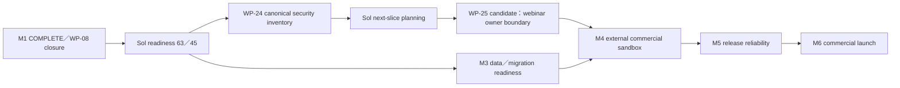

# CelebrateDeal 滾動式 Master Execution Plan

PLAN_STATUS：READY_FOR_TERRA
PLAN_VERSION：2
PLANNED_AT：2026-07-29T01:59:43+08:00
SOURCE_INPUT：docs/ai-team/master-planning-input.md
CURRENT_BASELINE_COMMIT：8a78acd1b6cf22978a71eff4d7448a3730006d44
LAST_COMPLETED_MILESTONE：M1
CURRENT_MILESTONE：M2
CURRENT_EXECUTABLE_WP：WP-24
CURRENT_WP_COUNT：1
RECOMMENDED_EXECUTOR_MODEL：gpt-5.6-terra／High
USER_AUTHORIZATION_REQUIRED_TO_START：NO
PRODUCTION_ACCESS_REQUIRED：NO
SELF_HASH_CANONICAL_SHA256：87A1AB8D81405FBB37DB1501D178C7695FF428D6357F89893E414AFB3C858621

> 本文件是 living plan。M1 保留歷史執行契約；M2 依 current evidence 逐包詳細規劃；M3 與更後面的工作只保留方向與候選 Work Package。每個 Milestone 完成後必須停止，由 Sol 依最新程式碼、Git 與 canonical evidence 重新校準。

## 1. Executive summary

M1 已完成。WP-22-R1 commit `a4cdf0e` 與 WP-23 commit `8a78acd` 已將 WP-08 local deterministic evidence 關閉；canonical run `20260729050408559` 通過39 Browser tests、119 files／939 tests coverage（0 failed／0 skipped）及全部quality、integrity與cleanup gates。

Sol依此將Automatable Readiness由57／100重評為63／100；Full Commercial Launch維持45／100。本機evidence不代表deployment、正式資料、外部服務、screen-reader、法務或商業上線通過。

M2聚焦security／authorization residuals。第一個且唯一可執行單位為WP-24：重建current-HEAD canonical candidate inventory；不得把歷史52 candidates當成目前總數，也不得在inventory WP同時修改產品程式碼。

## 2. Current verified baseline

### 2.1 Repository baseline

- Branch：`chore/ai-team-v5.1-migration`
- HEAD：`8a78acd1b6cf22978a71eff4d7448a3730006d44`
- staged files：0
- Current readiness：Automatable `63/100`；Full Commercial Launch `45/100`
- 現行 PostgreSQL migrations：13
- 最新 WP-08 Browser：39 passed／0 failed
- 最新 WP-08 coverage：119 files／939 passed／0 failed／0 skipped
- M2 current surface：27 route handlers、5 Server Action modules、50 textual exported async actions

### 2.2 Dirty inventory ownership

WP-24 preflight時只有既有 `tests/e2e/smoke.spec.ts` 修改且staged為空。WP-24只可產生下列七個allowlist文件的變更；其中current work package是ignored control-plane packet，其餘六份為tracked／new tracked候選文件。M1 inventory保留在下方作歷史紀錄，不再作current gate。

| 相對路徑 | Ownership | WP-24可修改 | 備註 |
|---|---|---:|---|
| `docs/ai-team/current-work-package.md` | WP-24 | YES | ignored control-plane packet；不得force-add |
| `docs/ai-team/master-execution-plan.md` | WP-24 | YES | M1 closure、readiness與M2 record |
| `docs/launch/m2-security-authorization-inventory-20260729.md` | WP-24 | YES | 新增canonical inventory |
| `docs/launch/production-readiness-baseline.md` | WP-24 | YES | Current score 63／45 |
| `docs/launch/wp08-product-browser-qa-20260728.md` | WP-24 | YES | 同步Sol重評 |
| `docs/launch/evidence-index.md` | WP-24 | YES | 增加WP-24 evidence |
| `docs/launch/next-work-packages.md` | WP-24 | YES | 增加WP-24 closure |
| `tests/e2e/smoke.spec.ts` | USER_EXISTING | **NO** | 必須byte-stable，不納入任何diff／stage |

#### Historical M1 ownership snapshot

本表是 Terra 啟動前的 fail-closed ownership baseline。寫入本文件後共 11 個 dirty paths；所有 ownership 均已明確，沒有 `UNKNOWN`，也沒有無法安全分離的 mixed hunks。

| 相對路徑 | Git 狀態 | 目前 diff 摘要 | Ownership | 預計處理單位 | WP-22 可修改 | WP-23 可修改 | Terra 必須保持不動 | Mixed hunks | Baseline SHA-256 |
|---|---|---|---|---|---|---|---|---|---|
| `docs/launch/current-snapshot-regression-baseline.md` | tracked modified | 新增歷史 WP-08 38/1 follow-up | HISTORICAL_WP08 | WP-23 | NO | YES | WP-22 期間 YES | NO | `BF4871E2CB7BE325E4FFE011D3A0CC7C59824C2DA2CD89EDF6F11A464A471B5C` |
| `docs/launch/evidence-index.md` | tracked modified | 新增歷史 WP-08 receipts 與 38/1 結論 | HISTORICAL_WP08 | WP-23 | NO | YES | WP-22 期間 YES | NO | `7445BF8B42FACEA2C2A96E920D076B3C81C554D7D8745F7D03644DE93CA80122` |
| `docs/launch/manual-blockers.md` | tracked modified | 新增歷史 password-reset blocker | HISTORICAL_WP08 | WP-23 | NO | YES | WP-22 期間 YES | NO | `780AFA1A3E0DC8DEA2E8377005FEDEAC00C5ECDF728A36B391ACA0291B6E084D` |
| `docs/launch/next-work-packages.md` | tracked modified | WP-08 從舊待辦改為 38/1 rework | HISTORICAL_WP08 | WP-23 | NO | YES | WP-22 期間 YES | NO | `FE9495356490F15A96FEB69703DDF0E391749D44E028BE6FDF9DCCAD153B4AFC` |
| `docs/launch/production-readiness-baseline.md` | tracked modified | 新增歷史 WP-08 38/1 readiness 說明 | HISTORICAL_WP08 | WP-23 | NO | YES | WP-22 期間 YES | NO | `FD554032804984176303517EB37EB676E696C65EB93F45E9CE934E4A3D861BEE` |
| `docs/launch/tool-blockers.md` | tracked modified | 新增 TB-18 Chromium cache closure | HISTORICAL_WP08 | WP-23 | NO | YES | WP-22 期間 YES | NO | `3E06F190C087A926C478358F585C95291AF951F15BA79C6ECF31EB8C9853BA47` |
| `tests/e2e/smoke.spec.ts` | tracked modified | 公開 commerce test 新增 trace 與 screenshot | PUBLIC_COMMERCE | WP-22 僅採納既有 hunk | NO | NO | 除精確 stage 外 YES | NO；兩個 hunk 屬同一 artifact gate | `85F369DA012D4CB1098F8E0D2B95D5A01E92860D7C640231F48A7B6DD3B42AF8` |
| `.ai-team/scripts/Invoke-Wp08ProductBrowserQa.ps1` | untracked | 344 行 WP-08 isolated runner 與三 schema bridge | WP-22 | WP-22 | YES | NO | WP-23 期間 YES | NO | `7A96E82F57DC11610992A43A14CD584E7FF865E6469684ED9B31D02E3353FF7D` |
| `docs/ai-team/master-planning-input.md` | untracked | Sol 全站事實盤點與規劃輸入 | MASTER_PLANNING_INPUT | M1-PLANNING-COMMIT | NO | NO | planning commit 後 YES | NO；整份為單一 planner artifact | `4FC8DD1DB569B276122E174EF922482A082A7315D90EF18A9A781F387CB1F1D1` |
| `docs/launch/wp08-product-browser-qa-20260728.md` | untracked | 歷史 WP-08 38/1 evidence 報告 | HISTORICAL_WP08 | WP-23 | NO | YES | WP-22 期間 YES | NO | `319AB1A9B4F383182DB4541CF65DF0923B1A4A248B554018345ABE1325A41651` |
| `docs/ai-team/master-execution-plan.md` | untracked | 本 rolling Master Plan | MASTER_PLAN | M1-PLANNING-COMMIT；後續 checkpoint | checkpoint only | checkpoint only | full runner 期間 YES | NO；整份為單一 planner artifact | 見 Header `SELF_HASH_CANONICAL_SHA256` |

`SELF_HASH_CANONICAL_SHA256` 的算法：以 UTF-8 讀取本檔，先將 Header 的整行值正規化為 `SELF_HASH_CANONICAL_SHA256：SELF_HASH`，再計算 SHA-256。這避免文件將自身 hash 寫入自身造成循環。

### 2.3 Ownership fail-closed 規則

- WP-24開始前與結束後都必須確認staged為空。
- 除七個WP-24 allowlist文件與既有smoke diff外，任何dirty path均停止。
- `tests/e2e/smoke.spec.ts`不得修改、stage或納入WP-24 rollback。
- 下列M1規則只保留為歷史執行契約。
- Terra 開始前必須重新計算 11 個 paths 的 Git 狀態與 SHA-256。
- planning commit 後，`master-planning-input.md` 與 `master-execution-plan.md` 應由 untracked 轉成 tracked clean；其餘 inventory 不得漂移。
- 新增未知 path、staged change、hash 不符或出現無法安全分離的 hunk，一律停止。
- 不得以 restore、checkout、reset、clean 或 stash 讓 inventory 看起來符合。

## 3. Removed／merged／superseded WP

- `WP-16-GR-01`：已被 WP-16 Git 工作樹歸零 closure supersede，只保留歷史 evidence。
- `WP-01`：淘汰為獨立 Work Package；改成實際需要 AGY 時才執行的 time-of-use preflight。
- `WP-02`：移出產品 critical path；TB-04 保留為 non-blocking tooling issue，本機 Playwright runner 是目前 canonical fallback。
- `WP-03`＋`WP-11`：合併為延後的 Git checkpoint hygiene 工作，必須另取得人工授權。
- `WP-06`：本機 candidate remediation 已由 WP-12、WP-13、WP-14 關閉；只保留需人工授權的正式 legacy data／backup／rollback review。
- `WP-10`：拆到 M4～M6，不再用一個 WP 同時承載 Supabase、PayUni、observability、DNS、法務與營運。
- `WP-20`：COMPLETE，不重開。
- `WP-21`：保留為coverage bridge integration歷史 remediation；已由WP-22-R1 closure取代。
- `WP-22`／`WP-23`／`WP-08`：全部`COMPLETE`，不重開。

## 4. Dependency graph



## 5. Milestone roadmap

| Milestone | 名稱 | 商業／技術目的 | 包含 WP | 依賴順序 | 平行性 | 完整 integration gate | Readiness 預期影響 | Sol 重校準 | 人工授權點 | 停止條件 |
|---|---|---|---|---|---|---|---|---|---|---|
| M1 | WP-08 deterministic local closure | 建立可信的本機 Browser、coverage、quality與cleanup同次證據 | WP-22、WP-23；前置planning commit | planning commit → WP-22 → WP-23 | 完成 | run `20260729050408559`全綠＋文件一致 | Automatable 57→63；Full 45 | COMPLETE | 無額外授權 | 已停止並交回Sol |
| M2 | Security與authorization residuals | 重建current-HEAD candidate inventory與tenant權限證據 | WP-24；後續切片待Sol | M1→WP-24 | 寫入仍單一Worker | current surface＋candidate classification＋static gates | WP-24不自行加分 | YES | 外部ACL、產品決策另授權 | WP-24完成、Critical／High、產品決策或外部scope |
| M3 | Data、migration、backup／rollback readiness | 將WP-06殘項轉為非正式rehearsal與授權式legacy review | 待Sol切片 | M1後；WP-12～14已完成 | disposable rehearsal可與M2概念平行 | backup／restore／rollback receipts | 資料完整性類別可能提升 | YES | 任何正式資料盤點 | 正式DB、legacy mapping或破壞性操作 |
| M4 | External commercial sandbox | 分別驗證Supabase ACL、PayUni sandbox與observability | 待Sol切片 | M2＋M3 | 各外部gate概念獨立；寫入不平行 | sandbox、idempotency、delivery receipts | Commercial readiness可能提升 | YES | Secret、帳號、sandbox服務 | 付費、正式金流、正式Secret |
| M5 | Release、deployment與reliability | 部署／rollback rehearsal、telemetry與screen-reader | 候選 | M4 | 人工檢查可分流 | rollback rehearsal、delivery、人工journey | Release／UX類別可能提升 | YES | 部署與外部dashboard | 正式部署或不可逆操作 |
| M6 | Commercial operations | DNS、法務、客服與商家onboarding | 候選 | M5 | 人工owner可分工 | signed manual checklist | Full Commercial Launch最終判定 | YES | 全部為人工gate | 任一owner未簽核 |

## 6. Detailed first Milestone — M1

### 6.1 Milestone contract

- Milestone ID：M1
- 名稱：WP-08 deterministic local closure
- 商業／技術目的：補齊可信的 app-level Browser 與完整 coverage evidence，消除過時 launch 摘要。
- 包含 WP：WP-22、WP-23；另有非 WP 的 `M1-PLANNING-COMMIT`。
- 依賴順序：planning commit → WP-22 → WP-23。
- 可平行項目：無。
- 完整 integration gate：WP-22 同次 full runner 全部通過；WP-23 receipts與launch文件一致。
- Readiness 預期影響：只提供 Sol 重評依據；Terra 不直接提高 57／45。
- 完成後 Sol 重校準：YES。
- 人工授權點：M1 三筆本機 commit 已由使用者明確授權；沒有其他授權。
- 正式環境：禁止。
- 停止條件：M1完成即停止；不得自動進入M2。

### 6.2 M1-PLANNING-COMMIT（非 WP）

目的：在任何 WP-22 修改前，先建立乾淨、可恢復的規劃基線。

唯一可 stage 路徑：

- `docs/ai-team/master-planning-input.md`
- `docs/ai-team/master-execution-plan.md`

Commit：

```text
docs(ai-team): add rolling master execution plan
```

Gate：

1. staged 起始為空。
2. planning input SHA-256 必須等於 inventory baseline。
3. 兩份規劃文件不得有 mixed hunks。
4. `git diff --cached --name-only` 必須恰好等於兩個 allowlisted paths。
5. staged diff review、`git diff --cached --check`、secret scan通過。
6. commit成功後重新確認其餘9個dirty paths與hash均未變。

任一條件不符就停止，不得開始 WP-22。

### 6.3 WP-22 — WP-08 runner runtime isolation與完整重驗

**WP ID**：WP-22
**名稱**：WP-08 runner runtime isolation與完整重驗
**優先級**：P0
**目的**：保留已存在的WP-17／WP-18 owner bridge，排除runner runtime自我污染，完成WP-08同次all-gate closure。
**依賴**：M1 planning commit、WP-19、WP-20、WP-21 candidate、loopback PostgreSQL與本機Chromium。
**目前證據**：run `20260728170501031` 的Browser為39/0，三schema migrate／cleanup PASS；lint掃描snapshot內Playwright transform cache而FAIL；coverage未執行。
**Root cause**：runner把TEMP／TMP／HOME／cache放在snapshot source tree；manifest另錯納ignored Goal state。
**預估時間**：60～90分鐘。
**風險等級**：MEDIUM-HIGH。
**建議模型**：gpt-5.6-terra／High。
**需要人工授權**：NO；使用者已授權精確本機commit。
**涉及正式環境**：NO。
**涉及 migration**：YES，但只允許既有13 migrations在三個loopback marker-gated disposable schemas執行deploy/status；不建立或修改migration。

#### 精確修改範圍

允許實際修改：

- `.ai-team/scripts/Invoke-Wp08ProductBrowserQa.ps1`
- `docs/ai-team/master-execution-plan.md`：只能在post-run manifest建立後更新execution checkpoint。
- `.ai-team/state/goal-state.json`：ignored checkpoint，只能在post-run後更新，不stage。
- `.ai-team/logs/goal-progress.md`：ignored progress，只能在post-run後更新，不stage。

`tests/e2e/smoke.spec.ts` 的預設是**不得修改**。WP-22只可在hash仍等於 `85F369DA012D4CB1098F8E0D2B95D5A01E92860D7C640231F48A7B6DD3B42AF8`，且diff恰好只有下列PUBLIC_COMMERCE hunks時採納並精確stage：

- 約第1142行：test callback加入`testInfo`，並啟動`page.context().tracing.start({ screenshots: true, snapshots: true, sources: false })`。
- 約第1154～1155行：建立`wp08-public-commerce.png`與`wp08-public-commerce-trace.zip`。

來源：歷史WP-08 public commerce artifact gate。
採納理由：runner明確要求這兩個public-only artifacts，且最新39/0 Browser evidence已包含此hunk。
安全邊界：不得加入其他test修改；若hash或hunk漂移，從WP-22 commit排除並停止，不得restore、覆寫或丟棄。

#### 不處理範圍

- 任何產品程式碼。
- protected DB tests。
- `vitest.synthetic-db-coverage.config.ts`。
- Prisma schema、migration、model。
- package scripts或lockfile。
- coverage threshold、assertion、skip／exclude。
- 任何launch文件內容。
- readiness重新計分。

#### 實作步驟

1. 重驗branch、HEAD、staged=0、planning commit與剩餘inventory hashes。
2. 將runtime root移至snapshot的run-specific安全sibling。
3. TEMP、TMP、HOME、USERPROFILE、npm cache、Playwright transform cache不得位於snapshot source tree。
4. runtime root建立marker、嚴格驗證絕對路徑，finally中marker-gated cleanup。
5. source manifest改用Git tracked files加明確allowlisted untracked source，不再以全樹遍歷後過濾。
6. snapshot與manifest排除`.env*`、`.private`、Goal state、logs、reports、receipts、snapshot、runtime、TEMP、TMP、HOME、cache及ignored generated artifacts。
7. 保留六個coverage bridge variables、三schema identity與synthetic coverage config invocation。
8. 完成修改與targeted static gates後建立pre-run manifest。
9. full runner期間禁止更新Master Plan、Goal state或任何control-plane source。
10. runner結束後立即建立post-run manifest並比較。
11. 只有pre-run與post-run manifest完全相同，才可更新checkpoint與進入commit。

#### Source manifest contract

- 合法WP-22修改發生在pre-run manifest之前；不得比較修改前與修改後manifest。
- pre-run與post-run inventory必須相同且hash byte-identical。
- Git tracked files全部納入，但依安全規則排除`.env*`、`.private`與control-plane/generated paths。
- allowlisted untracked source只允許目前runner與仍待WP-23處理的WP-08 evidence文件；任何新增untracked path停止。
- runner不得把generated files寫入產品source tree。

#### Targeted tests

- PowerShell parser PASS。
- runner runtime root、marker與cleanup靜態契約 PASS。
- owner bridge、三schema identity、config invocation靜態契約 PASS。
- `.env*`／`.private`／control-plane exclusion契約 PASS。
- `npm run secret:scan` PASS。
- runner與smoke精確diff review PASS。
- `git diff --check` PASS。

#### Coverage fixed gate

目前固定 expected discovery count：

- 119 files
- 939 passed
- 0 failed
- 0 skipped

依據：

- WP-19 canonical run `20260728213657260` 已取得119／939／0／0。
- 後續WP-08舊coverage取得937 passed＋2 skipped，總discovery仍為939。
- WP-22不允許修改test inventory，因此可把119／939作固定gate。

若count改變，視為source drift並停止；不得降低threshold、動態接受較少測試、排除test或新增skip。

#### Integration gates

- npm ci：PASS
- secret scan：PASS
- Prisma validate／generate：PASS
- wp08／wp17／wp18 bootstrap：PASS
- 三schema 13 migrations deploy/status：PASS
- Playwright discovery：exactly 39
- Browser E2E：39 passed／0 failed／0 skipped
- lint：PASS
- typecheck：PASS
- strict-index：PASS
- coverage：119 files／939 passed／0 failed／0 skipped
- global與`src/lib` thresholds：維持既有值且PASS
- public-only screenshot與trace：恰好兩份
- external side-effect scan：PASS
- 三schema cleanup：PASS
- snapshot與runtime cleanup：PASS
- source Git與pre/post manifest：unchanged

#### 完成條件

全部targeted tests與integration gates通過；sanitized receipts完整；source未污染；Git ownership安全。

#### Commit 邊界

Commit：

```text
test(qa): isolate wp08 runner runtime
```

可stage：

- `.ai-team/scripts/Invoke-Wp08ProductBrowserQa.ps1`
- `tests/e2e/smoke.spec.ts`的兩個既有PUBLIC_COMMERCE hunks
- `docs/ai-team/master-execution-plan.md`的WP-22 checkpoint

不得stageGoal state、logs、reports、receipts或任何launch文件。

#### Rollback

不在M1中自動rollback已提交commit。若後續需要回復，由獨立授權的recovery Task使用`git revert <WP-22 commit>`；不得reset／checkout。執行中資源只由marker-gated cleanup移除。

#### Checkpoint要求

記錄root cause、修改檔案、run ID、receipt hashes、test matrix、commit hash、remaining dirty inventory與未解風險。

#### 可自動進入下一WP的條件

- WP-22全部gate PASS。
- commit成功。
- staged重新為空。
- Git狀態只剩WP-23 allowlist文件。
- 沒有未知path、mixed hunks或hash漂移。

#### 必須停止的條件

- 任一產品gate FAIL。
- coverage出現failed、skipped或count漂移。
- cleanup不完整。
- 需修改產品、test、Vitest config、Prisma或package files。
- smoke hash／hunk不符。
- source manifest漂移。
- 第二次相同失敗、必要工具阻擋或scope超出WP-22。

### 6.4 WP-23 — WP-08 closure與launch evidence reconciliation

**WP ID**：WP-23
**名稱**：WP-08 closure與launch evidence reconciliation
**優先級**：P0
**目的**：以WP-22 canonical receipts關閉原始WP-08，消除38/1、coverage skip與pre-snapshot歷史敘述衝突。
**依賴**：WP-22 COMPLETE且commit成功。
**目前證據**：現有launch文件仍停在歷史38/1或較早blocker。
**Root cause**：canonical receipts的更新時間晚於部分launch摘要。
**預估時間**：30～60分鐘。
**風險等級**：LOW。
**建議模型**：gpt-5.6-terra／High。
**需要人工授權**：NO；使用者已授權精確本機commit。
**涉及正式環境**：NO。
**涉及 migration**：NO。

#### 精確修改檔案

版本控制文件：

- `docs/ai-team/master-execution-plan.md`
- `docs/launch/current-snapshot-regression-baseline.md`
- `docs/launch/evidence-index.md`
- `docs/launch/manual-blockers.md`
- `docs/launch/next-work-packages.md`
- `docs/launch/production-readiness-baseline.md`
- `docs/launch/tool-blockers.md`
- `docs/launch/wp08-product-browser-qa-20260728.md`

ignored control-plane checkpoint；允許修改但不得stage：

- `.ai-team/state/goal-state.json`
- `.ai-team/logs/goal-progress.md`

#### 必須保持不動

- `.ai-team/scripts/Invoke-Wp08ProductBrowserQa.ps1`
- `tests/e2e/smoke.spec.ts`
- `docs/ai-team/master-planning-input.md`
- 全部產品、test、Prisma、migration、Vitest與package files

#### 實作步驟

1. 解析WP-22 final summary與receipt hashes。
2. 驗證所有必要gate、source manifest與cleanup都是PASS。
3. WP-08標記COMPLETE；WP-21保留歷史；WP-22標記COMPLETE。
4. 逐一更新8個allowlisted版本控制文件。
5. 移除過時現況敘述，但保留清楚標示為歷史的38/1 evidence。
6. readiness維持57／45，註明待Sol重新計分。
7. 更新Goal checkpoint與Master Plan execution record。

#### Targeted tests

- JSON receipts可解析。
- 必要gate matrix全部PASS。
- Master Plan必要章節與引用路徑存在。
- 8個文件對WP-08／21／22狀態一致。
- `npm run secret:scan` PASS。
- `git diff --check` PASS。

#### Integration gate

- 不再把38/1或pre-snapshot failure描述成最新狀態。
- 不宣稱正式、sandbox、部署或商業上線通過。
- readiness未由Terra自行增加。
- staged diff恰好是WP-23 allowlist。

#### 完成條件

文件、Goal checkpoint、Master Plan與receipts一致；commit成功；staged為空。

#### Commit邊界

```text
docs(launch): close wp08 deterministic evidence
```

只stage上述8個版本控制文件；Goal state與logs不得stage。

#### Rollback

由另行授權的recovery Task使用`git revert <WP-23 commit>`；不影響WP-22程式commit與既有receipts。

#### Checkpoint要求

記錄WP-08 final verdict、WP-22／23 commits、receipt hashes、Git狀態、readiness未重算原因與交回Sol的下一步。

#### 可自動進入下一WP的條件

無。WP-23完成即代表M1完成，必須停止。

#### 必須停止的條件

- receipts不完整或任一gate不是PASS。
- 文件需要超出allowlist。
- readiness需要產品owner決策。
- Git ownership／mixed hunks不安全。
- M1完成。

## 7. Later Milestone outlines

### M2 — Security與authorization residuals

- WP-24已依current HEAD重建20個具名歷史候選、6個current authorization residuals與external/manual register。
- 舊52項只有20項具名；未具名32項固定為`HISTORICAL_DETAIL_UNAVAILABLE`，不列為current finding。
- Current surface為27 route handlers、5 Server Action modules與50 textual exported async actions；surface本身不是finding。
- 下一個local候選是WP-25 webinar owner-boundary release-mode negative evidence；必須先交回Sol另行規劃。
- Supabase正式ACL、產品決策、正式Secret、付款、部署與正式資料不納入自動WP。

### M3 — Data、migration、backup／rollback readiness

- 將WP-06剩餘工作重新命名為legacy data與rollback readiness。
- 先做loopback disposable backup／restore／rollback rehearsal。
- 正式legacy rows只允許在獨立人工授權WP盤點與mapping。

### M4 — External commercial sandbox

- Supabase ACL、PayUni sandbox、observability各自獨立WP。
- 每個外部服務各有Secret、帳號、付費與side-effect授權邊界。

### M5 — Release、deployment與reliability

- 部署與rollback rehearsal、telemetry delivery、screen-reader journey分開驗收。
- 不把本機build或Browser結果外推成正式部署PASS。

### PRELAUNCH_DEV execution protocol

`WORKFLOW_MODE：PRELAUNCH_DEV`

本節只更新未來執行協議，不改變既有 WP 結果、receipts、M1、WP-25、M2-A01 或 readiness。`docs/ai-team/workflow-policy.md` 與 `workflow-mode.md` 是本節的 canonical 補充；其規則優先於本文件較早的 M1／WP-24 歷史執行契約。

- living Master Plan、goal state、checkpoint、sanitized receipts、logs 與 runtime metadata 是 `MUTABLE_CONTROL_PLANE`，不納入產品 source manifest；self-hash 保留為資訊性 integrity metadata，不得成為 control-plane 更新的 blocking gate。
- 不再使用固定 dirty path count。每個 dirty path 必須有 ownership，`UNKNOWN` 或無法安全分離的 mixed hunks 仍為 hard stop；`HARD_PROTECTED` 的非預期變更與 `PRESERVE_ONLY` 覆蓋仍不允許。
- 同一 WP 可在 3 輪 bounded remediation 與 2 次 canonical full run 的配額內持續；每次 full run 前可執行 targeted diagnostic。Terra 可在同一 root cause 與驗收目標下擴張最多 8 個直接相關檔案並記錄 scope expansion。
- 每個 Milestone 完成後仍停止並交回 Sol；不得自動進入下一個 Milestone。正式環境、正式 DB、正式 Secret、付費、部署與未核准破壞性 migration 仍是人工授權點。

### M6 — Commercial operations

- DNS、法務、客服、商家onboarding由人工owner簽核。
- 最終Commercial Launch verdict只能建立在完整signed checklist。

## 8. Terra execution protocol

WP-24是M2第一個且唯一獲授權的文件型WP。它只允許current work package、Master Plan、canonical inventory與四份launch evidence文件；不授權產品修改、產品測試、runner、外部工具、stage或commit。

每完成一個WP，Terra必須：

1. 依WP類型執行必要的deterministic gates；WP-24只做static/reference validation。
2. 不得用未執行的產品測試作PASS。
3. 建立sanitized evidence。
4. 只有另獲commit授權時才可精確stage。
5. diff review、diff check、secret scan與staged-empty gate。
6. 未授權時保持未staged／未commit。
7. 更新WP狀態。
8. 寫入checkpoint。
9. 更新Master Plan execution record。
10. 確認Git可安全進入下一WP。
11. 完成後停止並交回Sol；不得自選下一WP。

不得：

- `git add .`
- `git add -A`
- `git commit -a`
- 混合不同WP
- 跳過失敗測試
- 降低assertion或threshold
- 偽造evidence
- 因Gemini QA失敗偽造deterministic gate失敗
- 自動跨越人工授權點或WP／Milestone邊界

## 9. Test strategy

- M1歷史：M1-PLANNING-COMMIT、WP-22與WP-23 gates均已完成。
- WP-24：current source manifest、20個具名候選分類、6個authorization residuals、Markdown references、allowlist、secret與diff gates；不跑產品測試。
- Lite Goal bootstrap因舊WP-08 phase不一致被拒絕，記為control-plane `TOOL_BLOCKED`；不掩蓋WP-24文件型deterministic結果。
- 任何未執行gate不得標PASS。

## 10. Git and commit protocol

M1歷史已授權並完成以下三筆本機commit：

1. `docs(ai-team): add rolling master execution plan`
2. `test(qa): isolate wp08 runner runtime`
3. `docs(launch): close wp08 deterministic evidence`

WP-24明確未授權stage或commit。若後續另行授權，單一候選commit為：

`docs(security): establish m2 residual inventory and readiness`

仍明確未授權：

- push
- merge
- rebase
- amend
- reset
- clean
- stash
- 部署
- 正式環境／資料／Secret
- 任何產品修改或WP-25／後續Milestone

每筆commit前必須：

1. staged起始為空。
2. 精確stage allowlisted paths／hunks。
3. `git diff --cached --name-status`符合commit邊界。
4. review完整cached diff。
5. `git diff --cached --check` PASS。
6. secret scan PASS。

## 11. Evidence and checkpoint protocol

- Raw logs、reports、receipts留在ignored位置，不得stage。
- Sanitized receipt不得包含URL credentials、Token、Cookie、Secret、正式資料或付款資料。
- 每個checkpoint記錄root cause、files、tests、receipts、commit、Git狀態與剩餘風險。
- runner執行期間禁止更新Goal state、Master Plan或progress log。
- 只有post-run manifest完成後才可更新control-plane checkpoint。
- Master Plan execution record至少包含開始時間、完成時間、commit、run ID、結果與下一步。

## 12. Stop and escalation conditions

Terra遇到以下任一情況必須停止：

1. 需要使用者授權或產品決策。
2. 需要正式Secret、正式DB或正式服務。
3. 需要部署、付費或破壞性操作。
4. root cause與Master Plan明顯不一致。
5. 修改範圍需要跨越WP邊界。
6. 出現安全、權限、金流或資料遺失風險。
7. 必要測試環境或工具阻擋。
8. Git ownership不明或存在無法安全分離的mixed hunks。
9. 同一WP經一次修復與一次允許重試後仍無法通過。
10. WP-24完成，需要Sol規劃下一個M2切片。
11. Master Plan過時或依賴順序失效。
12. Token、時間或上下文不足以安全繼續。

以下狀況不必停止整個Goal：

- 可在同一WP scope修復的lint或typecheck問題。
- 明確、小範圍且不降低assertion的test query bug。
- 可原樣重試一次的deterministic transient failure。
- 非必要Gemini QA `TOOL_BLOCKED`。
- 不影響後續WP的文件小錯誤。

## 13. Readiness scoring policy

- M1 closure後Automatable Readiness為`63/100`，由既有`57/100`加上類別2 `+2`、類別6 `+2`、類別7 `+1`、類別8 `+1`。
- Full Commercial Launch維持`45/100`。
- 63分只代表current-HEAD local deterministic evidence；不得外推為deployment、正式資料、外部服務或商業上線通過。
- External、production、screen-reader、legal、support與operations evidence未完成前，不提高Full Commercial Launch。
- 後續Terra不得因單一M2 WP自行加分；每個Milestone結束後交回Sol重評。

## 14. Recovery and resume instructions

中斷後：

1. 讀取Master Plan最後execution record、Goal state、Git log與status。
2. 驗證已完成commit與receipt hashes。
3. 已通過且hash一致的gate不重跑。
4. M1已完成，不重跑WP-22／WP-23。
5. WP-24中斷時，只核對七個allowlist文件與既有smoke diff。
6. Lite Goal state仍因舊WP-08 phase不一致受阻時，不手動修改state；保存`TOOL_BLOCKED`並繼續文件驗證。
7. hash漂移、未知path或scope失效時停止交回Sol。
8. 不使用reset、checkout、clean或stash恢復。

## 15. Known unknowns

- 歷史52-candidate raw artifacts不在repository；summary只具名20項，未具名32項保持`HISTORICAL_DETAIL_UNAVAILABLE`。
- 歷史scan baseline到HEAD的產品／測試範圍已變更133個檔案；current inventory不得繼承歷史總數。
- Current source surface為27 route handlers；舊authorization matrix的47 actions已漂移，current textual inventory為50 exported async actions。
- 外部服務、正式資料、部署、Supabase ACL、screen-reader、法務與商業gate仍未驗證，不由本機結果推論。
- Goal state頂層`complete`與歷史pending／in-progress phase不一致；此行政異常不重開M1，但阻擋Lite bootstrap新Goal。
- Git long-path checkpoint問題延後處理，不阻擋M2文件盤點。

## 16. Plan change log

| Version | 日期 | 變更 |
|---|---|---|
| 1 | 2026-07-29 | 建立rolling Master Plan；以最新WP-08 final summary更新根因；建立M1 planning commit、WP-22與WP-23；加入完整dirty ownership、manifest時點、smoke hunk與commit授權邊界。 |
| 2 | 2026-07-29 | 確認M1 closure與commits；Automatable readiness調整為63、Full維持45；建立WP-24 current-HEAD security／authorization inventory與M2邊界。 |

## 17. M1 execution record

| 時間（UTC） | 單位 | 結果 | 證據／後續 |
|---|---|---|---|
| 2026-07-29T04:31:22Z | M1-PLANNING-COMMIT | PASS；commit `f2bacb1` | 兩份規劃文件精確暫存、cached diff review、diff check與secret scan均通過；其餘9個dirty path hash未漂移。 |
| 2026-07-29T04:31:22Z | WP-22 | FAIL；停止M1 | 單次 canonical run `20260729042417940` 的 unit-coverage exit 1。已執行的Browser、quality、source manifest、package lock、snapshot/runtime與三schema marker cleanup皆PASS；coverage未完成固定119／939／0／0 gate。不得執行WP-23、不得更新launch evidence或readiness；交回Sol重新規劃。 |
| 2026-07-29T05:04:08Z–05:11:26Z | WP-22-R1 | PASS；commit `a4cdf0e`；canonical run `20260729050408559` | npm ci、secret scan、Prisma、三schema、39 Browser、lint、typecheck、strict-index、119／939／0／0 coverage、source manifest、HARD_PROTECTED、PRESERVE_ONLY、snapshot/runtime與三schema cleanup全部PASS。 |
| 2026-07-29T05:12:58Z–05:14:04Z | WP-23／M1 closure | PASS；commit `8a78acd` | 8個allowlisted launch evidence文件已對齊canonical receipts；WP-08與M1為COMPLETE。Sol後續重評Automatable 63／100、Full Commercial Launch維持45／100。 |

## 18. M2 execution record

| 日期 | 單位 | 結果 | 證據／後續 |
|---|---|---|---|
| 2026-07-29 | WP-24 | PASS；未stage／未commit；Lite Goal bootstrap `TOOL_BLOCKED` | 已分類20個具名歷史候選、6個current authorization residuals及1列未具名32項gap；重建27 route handlers／50 exported async actions surface manifest。Markdown reference、secret scan、`git diff --check`、exact allowlist與staged-empty均PASS；既有`tests/e2e/smoke.spec.ts`未觸碰。完成後交回Sol，不自動開始WP-25。 |
