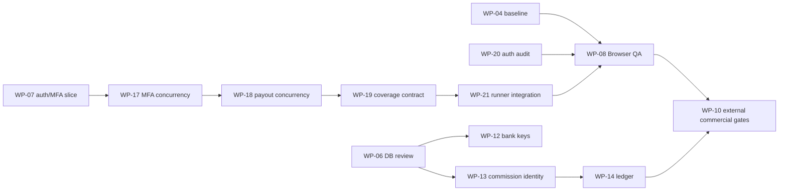

# CelebrateDeal 全站事實盤點（供 Sol High 規劃）

盤點日期：2026-07-29
範圍：唯讀查證；未執行產品測試、coverage、Browser E2E 或 migration。所有標為「推論」的內容均非 canonical verdict。

## 1. Repository 與 Git 現況

- Branch：`chore/ai-team-v5.1-migration`；HEAD：`c9fb082 docs(ai-team): standardize task handoff workflow`。
- 最近的產品／驗證 commits 已包含 WP-20 密碼重設修正（`dd17180`、`9e2b225`）、WP-19 coverage schema propagation（`5c9139c`）、WP-17／18 closure、金融、認證、核心流程與 CI gate 變更。這些能力已進入 Git。
- 工作樹有 9 個既存變更、0 staged：6 個 launch 文件、`tests/e2e/smoke.spec.ts`、未追蹤 `.ai-team/scripts/Invoke-Wp08ProductBrowserQa.ps1` 與 `docs/launch/wp08-product-browser-qa-20260728.md`。本文件是本次唯一新增路徑；既存變更不可視為本次盤點 ownership。
- Prisma 目前為 PostgreSQL schema，主 migration 清單有 13 支（`20260709090000_postgresql_baseline` 至 `20260728210000_add_affiliate_commission_accounting_ledger`）；另有 SQLite archive，不能混作現行 migration 基線。
- `package.json` 已有 lint、兩種 typecheck、Vitest coverage、Playwright、secret scan、Prisma 與 build scripts；不存在明確獨立 integration-test script。

## 2. Canonical evidence 品質與衝突

### 證據優先序

1. `.ai-team/state/goal-state.json` 最新 checkpoint（2026-07-28 17:08 UTC）與同 run 的 sanitized receipt。
2. `.ai-team/reports/wp-08-product-browser-qa-20260728170501031/wp-21-executor-failure.sanitized.json`。
3. 現在的 runner／受保護 tests／Git commits。
4. WP-specific launch evidence，例如 `docs/launch/wp19-coverage-synthetic-schema-20260728.md`。
5. 基準與待辦摘要；較早文字只作歷史背景。

### 已確認衝突

- **衝突：WP-08。** `docs/launch/next-work-packages.md`、`docs/launch/production-readiness-baseline.md`、`docs/launch/manual-blockers.md` 和 `docs/launch/current-snapshot-regression-baseline.md`仍描述最早的 `38 passed／1 failed` password-reset assertion；較新的 WP-20 checkpoint 與 receipt 已證明完整 WP-08 run 的 Browser 為 `39 passed／0 failed`，但 coverage 為 `937 passed／2 skipped`，故 WP-08 仍為 `REWORK_REQUIRED`。更晚的 WP-21 run 在 snapshot 前中止，無 deterministic test receipt，分類 `BLOCKED_BY_TEST_INFRA`。
- **衝突：TB-16。** `docs/launch/tool-blockers.md` 與 WP-19 evidence 說明 WP-18 runner 的 cross-WP coverage contract 已解除；這不代表 WP-08 runner 已取得該 contract。WP-21 已把 bridge variables 與三 schema lifecycle 寫入未追蹤 runner，但 canonical full run 在 snapshot 前結束，尚未證實整合成功。
- **衝突：WP-01／MB-01。** manual blockers 表示 WP-14 期間曾以互動式登入與 `agy models` 驗證，但 `docs/launch/next-work-packages.md`仍將 WP-01 列為待恢復登入；登入是時效性外部狀態，現況為 UNKNOWN，不能以歷史成功標 COMPLETE。
- **歷史已被取代：WP-16-GR-01。** `docs/launch/change-batch-plan.md` 的 NOT_READY checkpoint 已被同檔「WP-16 Git 工作樹歸零結案」及 `70b1c10` 的後續證據取代。

## 3. Work Package inventory

狀態總數：**21 個**可辨識 WP；COMPLETE 12、REWORK_REQUIRED 2、PARTIAL 1、BLOCKED 4、STALE 1、SUPERSEDED 1、READY 0、DUPLICATE 0、UNKNOWN 0。`WP-15` 沒有可辨識 canonical evidence，因此未虛構列入。

| WP | 名稱／現況 | Canonical evidence／最近 commit | 依賴、blocker與風險 | 執行判定 |
|---|---|---|---|---|
| WP-01 | AGY 登入；**STALE** | `docs/launch/next-work-packages.md`、MB-01；無現時驗證 commit | 外部互動登入；不涉 migration／正式環境，但需人工操作 | 不宜自動；Sol 先確認是否仍需存在 |
| WP-02 | Playwright MCP 單一註冊；**BLOCKED** | next packages、TB-04 | 依 WP-01；AGY Playwright MCP 仍 TOOL_BLOCKED；涉及使用者設定 | 需人工＋Sol；不作產品必要 gate |
| WP-03 | Git checkpoint refs 稽核；**PARTIAL** | evidence index、TB-06 | 診斷完成，預設 Windows Git long path 仍阻擋 `git log --all`；無產品／migration 風險 | 修復需人工授權；Sol 判定是否保留 |
| WP-04 | 無正式 env 回歸基準；**COMPLETE** | current snapshot baseline；`caf10b4` | 無依賴；11-migration historical disposable receipt、923 tests／39 discovery | 已自動完成；不可當作現在全產品 E2E |
| WP-05 | Vendor Member actions 拆分；**COMPLETE** | evidence index；產品 commits與 `b4bfa1f` | 依 WP-04；Fast wrapper non-blocking blocked | 已自動完成；無 migration |
| WP-06 | Candidate migration DB review；**REWORK_REQUIRED** | production baseline、evidence index | 原始 DB review 發現 key lifecycle／NULL-status policy；後續 WP-12、13 已關閉程式缺口 | **推論：** review 本身已被後續 remediation 部分取代，Sol 應重新定義剩餘正式資料 review |
| WP-07 | Security 52 candidates 第一切片；**COMPLETE** | evidence index、TB-13 | 只涵蓋 auth/MFA 四項；不等於 52 項全結束 | 自動完成；認證／安全；Sol 必須避免外推 |
| WP-08 | 產品 Browser QA；**REWORK_REQUIRED** | 最新 goal checkpoint、`.ai-team/reports/wp-08-product-browser-qa-20260728154848943/final-runner-summary.sanitized.json` | 依 WP-04／WP-20／WP-21；最新已知 Browser 39/0，但 coverage owner contract未經此 runner閉環 | 可自動驗證；安全、auth、DB；不涉正式環境 |
| WP-09 | AI Team runtime／工具政策切片；**COMPLETE** | evidence index、production baseline | 無產品功能 gate；Gemini label issue non-blocking | 已完成；不應重開為產品 WP |
| WP-10 | 外部商業 Gate；**BLOCKED** | next packages、MB-04~08 | 依前置產品 packages；Supabase、PayUni、observability、DNS、法務、營運 | 人工授權／正式或 sandbox 外部服務；Sol 深度確認 |
| WP-11 | Git checkpoint refs 授權修復評估；**BLOCKED** | next packages、TB-06 | 依 WP-03；persistent Git config／checkpoint ref migration | 需明確人工授權；不涉及產品 |
| WP-12 | 銀行帳戶 key lifecycle；**COMPLETE** | production baseline；`0746502` | 依 WP-06；金流、加密、migration | 自動完成於 disposable DB；正式資料仍需人工資料盤點 |
| WP-13 | Commission identity/status；**COMPLETE** | production baseline；`894cf46` | 依 WP-06；金流、資料完整性、migration | 自動完成於 disposable DB；legacy production mapping 人工授權 |
| WP-14 | Commission accounting ledger；**COMPLETE** | production baseline；`afe3b1b` | 依 WP-13；金流、payout、immutable ledger、migration | 自動完成於 synthetic DB；外部金流未驗 |
| WP-16 | Git 工作樹歸零；**COMPLETE** | change-batch plan、`70b1c10` | 包含已提交 domain batches與 migration disposable verification | 完成；**推論：** 不宜作新產品規劃單位 |
| WP-16-GR-01 | strict-index CI gate checkpoint；**SUPERSEDED** | change-batch plan、evidence index | 被 WP-16 結案證據取代 | 淘汰／僅保留歷史指標 |
| WP-17 | MFA recovery concurrency；**COMPLETE** | WP-19 evidence、`9359d57` | 依 WP-07；認證與 DB conditional claim | 自動完成；結論僅 current snapshot |
| WP-18 | Payout batch concurrency；**COMPLETE** | WP-19 evidence、`9359d57` | 依 WP-17／WP-19；金流與 DB claim | 自動完成；結論僅 current snapshot |
| WP-19 | Coverage schema flags；**COMPLETE** | `docs/launch/wp19-coverage-synthetic-schema-20260728.md`；`5c9139c`、`7e537f4` | 依 WP-18；已通過 119 files／939 tests；TB-16 RESOLVED | 不要與 WP-21 合併為「已解 WP-08」 |
| WP-20 | Password-reset audit remediation；**COMPLETE** | goal state、`wp-20...153530035`；`dd17180`、`9e2b225` | 依 WP-08 failure；auth/audit DB；Fast wrapper non-blocking TOOL_BLOCKED | 已完成 targeted scope；需要 WP-08 full runner 才能外推 |
| WP-21 | WP-08 coverage owner propagation remediation；**BLOCKED** | current work package、goal state、`.ai-team/reports/wp-08-product-browser-qa-20260728170501031/wp-21-executor-failure.sanitized.json` | 依 WP-19／WP-20；runner曾在 snapshot 建立前結束，無 test／cleanup receipts | 可自動執行但先需 Sol 重新界定執行阻斷；不涉正式環境／migration |

## 4. 已完成能力

- 核心：vendor-member action boundary、team funnel／lead／webinar／live 流程，以及 CI quality/browser regression gate 均有已提交變更。
- 認證與安全：login、MFA、password recovery、MFA recovery-code 的 PostgreSQL 一勝一敗 conditional claim 證據；但 WP-07 只完成 52 個候選的一個切片。
- 金流與資料：bank-account key version/rotation、commission identity/status、append-only accounting ledger、payout batch concurrency 的 disposable evidence與現行 Prisma models/migrations均存在。
- 測試基礎：WP-19 證明雙 owner coverage config、119 files／939 tests、lint、typecheck、strict-index、Prisma 與 secret scan 可在 synthetic loopback DB 通過；Browser suite 的 latest WP-08 receipt 亦已是 39/0。

## 5. 未完成產品缺口

- WP-08 的完整產品 Browser QA 尚未以同一次 canonical runner 完成所有 gates；因此 app-level Browser product evidence不能標 COMPLETE。
- WP-07 沒有完成其餘 security candidates；全站安全結論為 UNKNOWN。
- 外部商業流程（PayUni sandbox／callback、Supabase ACL、observability delivery、DNS、法務、客服、商家 onboarding）沒有本次可用的正式／sandbox closure evidence。
- **推論：** 現行產品功能提交很多，但沒有足夠新鮮的 end-to-end evidence 可將其整體宣稱為可商業上線。

## 6. 未完成測試與工具缺口

- WP-21 runner 的唯一最新結果是 snapshot 前非正常結束；缺少 source manifest、command receipts、final summary、任一 deterministic test及三 schema cleanup receipt。
- WP-08 的舊 coverage 缺口（WP-17／18 owner flags）已在 WP-19 runner中解除；對 WP-08 而言，現況是「整合未驗證」，不是已證實的產品／schema缺陷。
- 沒有獨立 integration-test command；WP-04 明確標為 NOT_APPLICABLE，不能把 unit coverage替代 integration suite。
- TB-04、TB-05、TB-06、TB-07、TB-12、TB-15、TB-17仍記錄為 TOOL_BLOCKED；其中 Gemini wrapper null ArgumentList 例外為 non-blocking，不能掩蓋 deterministic gate。

## 7. 人工 blocker

- MB-03：任何正式 DB legacy rows mapping／forward data fix。
- MB-04~08：Supabase ACL、PayUni sandbox/正式金流、observability、screen-reader、DNS／法務／客服／onboarding。
- WP-11：Git persistent long-path/ref repair 必須明確授權。
- **推論：** AGY登入不應再獨立排為現時 blocker，除非下一個需要 AGY 的包先做時效性檢查失敗。

## 8. Tool blocker

- 最直接：WP-21 canonical runner 的 snapshot 前中止（`BLOCKED_BY_TEST_INFRA`），原因 UNKNOWN；不能將它錯標為 TB-16重現。
- 歷史 TB-16 已由 WP-19解除，TB-18（Chromium cache）也已解除。
- Gemini Fast null-value／ArgumentList wrapper failures（TB-15、TB-17，WP-20 checkpoint相關現象）屬 non-blocking review工具問題；不應重試形成循環。

## 9. 安全、金流、認證與 migration 風險

| 領域 | 事實風險 |
|---|---|
| 認證 | WP-20 targeted audit修正已入 Git；但 WP-08 full-run gate未閉環，WP-07只覆蓋四個 security candidates。 |
| 金流／payout | WP-12~14與18已有 synthetic DB receipts；PayUni sandbox、callback與正式商家流程尚無 closure。 |
| 資料安全 | encryption key lifecycle、commission ledger和tenant scoped unique均在 schema/migrations存在；正式資料盤點、備份／rollback與legacy mapping需人工授權。 |
| migration | 13 支現行 PostgreSQL migrations；歷史「11 migrations」是 WP-04 時點資料，不可作目前數量。任何正式 migrate 禁止自動化。 |

## 10. WP 依賴候選

`WP-08 ← WP-21` 是目前唯一仍需 deterministic closure 的候選鏈；上圖不代表執行順序或最終優先級。

## 11. 重複、失效或應淘汰的 WP

- WP-16-GR-01：SUPERSEDED，保留歷史 receipt即可。
- WP-01：STALE；不要以過期「未登入」或一次歷史成功直接決定狀態。
- WP-06：**推論**應拆成「已由 WP-12／13 完成的 disposable remediation」與「需人工授權的正式 legacy 資料／rollback review」，避免把已完成缺口重複追蹤。
- WP-19 與 WP-21：不是 duplicate。前者驗證 WP-18 runner coverage contract；後者整合該 contract進 WP-08 runner並受執行阻斷。
- WP-08／WP-20：不是 duplicate。WP-20是 targeted auth fix；WP-08是全套產品 runner gate。

## 12. 候選 Milestones（非最終決策）

| 候選 | 目的／候選 WP | 前置依賴與主要風險 | Terra連續執行／Sol校準 | 建議整合 gate |
|---|---|---|---|---|
| M1 測試與驗證基礎 | WP-21 → WP-08 | WP-19/20已完成；runner pre-snapshot中止原因 UNKNOWN | 可連續，但在解出執行阻斷後、重跑前由 Sol校準 | 同一次 no-dotenv canonical run：39 Browser、119/939 coverage、0 skip、三schema cleanup、source unchanged |
| M2 核心產品流程與 Browser | WP-08及後續由 Sol辨識之產品 journeys | M1；目前僅有一套產品 Browser evidence | 可連續性 UNKNOWN；Sol 先切 30–90分鐘範圍 | product journey、a11y/performance只在明確範圍內 |
| M3 認證與權限擴展 | WP-07剩餘 candidates | WP-17完成但只 current snapshot | 可切片連續；每個切片後 Sol校準 | auth matrix、DB contract、targeted browser gate |
| M4 資料安全與一致性 | WP-06正式資料 review殘項 | WP-12/13/14；需人工授權才碰正式資料 | 不能純自動 | disposable migration/rollback rehearsal；正式資料只做授權盤點 |
| M5 金流與 payout sandbox | WP-10金融子範圍 | WP-14/18完成；PayUni與商家授權 | 不可完全自動；Sol於sandbox結果後校準 | sandbox webhook／payout receipts、idempotency、redaction |
| M6 Browser、部署與可靠性 | WP-10的observability／release子範圍 | 外部服務、DNS與發布權限 | 不可純自動 | deploy rollback rehearsal、telemetry delivery、release checklist |
| M7 商業上線與營運 | WP-10營運子範圍 | M4~M6與MB-04~08 | 人工主導；Sol於每個外部gate後校準 | signed manual checklist |

## 13. 第一個 Milestone 建議範圍

**候選 M1：只處理 WP-08 剩餘 coverage／canonical-runner blocker 的事實釐清與閉環。**

- 範圍：先確認 WP-21 為何在 snapshot前終止，再由 Sol 產出一個不擴張產品程式／測試／Prisma 的窄範圍方案；僅在方案具體授權後，執行一次完整 WP-08 canonical gate。
- 不含：產品功能、coverage threshold調整、protected DB tests、migration、正式環境、外部 QA 或 readiness重新計分。
- 停止條件：若未取得同一次完整 runner所有 receipts，WP-08維持 `REWORK_REQUIRED`，不得以 WP-19成功外推。

## 14. 需要 Sol High 決定的問題

1. WP-21應維持獨立 remediation、拆成「runner preflight診斷」與「full rerun」，或取代既有 WP-21？
2. WP-06剩餘工作是否應重命名為正式資料／rollback review，以免與已完成 WP-12／13重複？
3. WP-01是否應淘汰為時效性 preflight，而非獨立工作包？
4. WP-10應如何分成 sandbox、observability、release與商業營運等可授權的小包？
5. 在 Browser full-gate沒有新 receipt前，是否維持 readiness 57／100、commercial launch 45／100？（盤點建議：維持；最終決定權在 Sol／產品 owner。）

## 15. Sol High 必須精讀的檔案（15 個）

1. `AGENTS.md`
2. `docs/ai-team/workflow-policy.md`
3. `docs/ai-team/current-work-package.md`
4. `.ai-team/state/goal-state.json`
5. `.ai-team/reports/wp-08-product-browser-qa-20260728170501031/wp-21-executor-failure.sanitized.json`
6. `.ai-team/reports/wp-08-product-browser-qa-20260728154848943/final-runner-summary.sanitized.json`
7. `.ai-team/scripts/Invoke-Wp08ProductBrowserQa.ps1`
8. `docs/launch/wp19-coverage-synthetic-schema-20260728.md`
9. `vitest.synthetic-db-coverage.config.ts`
10. `src/app/actions.mfa-db.test.ts`
11. `src/app/actions.payout-db.test.ts`
12. `docs/launch/production-readiness-baseline.md`
13. `docs/launch/tool-blockers.md`
14. `docs/launch/manual-blockers.md`
15. `prisma/schema.prisma`

## 16. 不需要 Sol 重複讀取的低價值資料

- `.ai-team/logs/` raw command logs及過期重複 runner outputs；以最新 sanitized receipt為準。
- `prisma/migrations_sqlite_archive/`；非現行 PostgreSQL migration線。
- WP-04完整 raw logs；只需其基準摘要，除非要重查歷史安全隔離。
- 舊 WP-08 的 38/1 launch 摘要；它只能解釋歷史，不能覆蓋最新39/0＋coverage／runner evidence。
- 492-change 的早期分批建議原始清單；WP-16結案已取代其未提交前提。

## 17. Git 未提交變更 ownership

- 既存 9 路徑屬 WP-08／WP-20／WP-21與 launch evidence的混合工作區：6個 launch docs、`tests/e2e/smoke.spec.ts`、WP-08 runner及其 launch document。
- 本次盤點不取得上述路徑 ownership，也沒有修改它們。
- 本次唯一預期變更：`docs/ai-team/master-planning-input.md`。若後續 WP 需要修改既存 runner或 launch 文件，必須先重做精確 Git inventory與 hunk ownership判定。

## 18. 盤點限制與未知事項

- 未執行任何產品測試、coverage、Browser E2E或 migration；本文只引用既存 receipts。
- 未讀取 `.env*`、憑證、正式客戶／付款資料，也未接觸正式環境。
- WP-21 pre-snapshot終止的根因為 **UNKNOWN**；receipt未提供 stack trace或可驗證原因。
- 外部服務與人工 gate均為 UNKNOWN／未驗證，不從本機程式碼推論其正式可用性。
- Readiness 57／100及 Full Commercial Launch 45／100在現有 canonical文件中持續出現；本盤點不重算分數。
