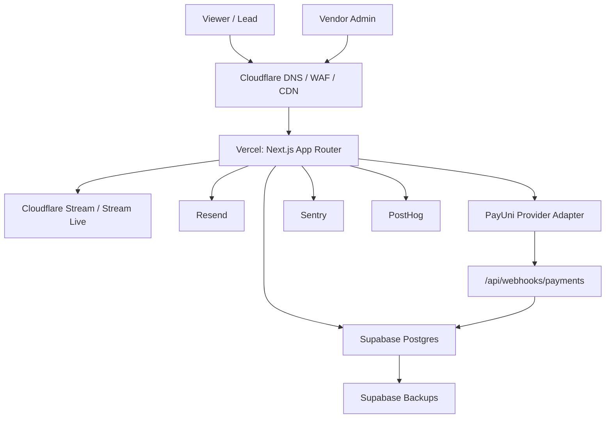

# CelebrateDeal 正式 MVP 上線基礎設施規劃

最後更新：2026-07-09

## 1. 目前專案判斷

CelebrateDeal 目前是 Next.js App Router + Prisma + PostgreSQL baseline 的 Cloudflare-first 直播導購 SaaS MVP；舊 SQLite 僅保留為本機歷史 demo 資料。已完成的核心方向包含：

- 自建前台直播導購頁：`/live/:slug`
- Cloudflare Stream / Stream Live 欄位預留
- 互動腳本、互動角色、商品浮出、CTA、報名表
- 聯盟推廣、來源追蹤、黑名單
- 用量、方案、月結、批次出款
- 金流 webhook、provider adapter、audit log、webhook 對帳中心

正式可收費 MVP 的核心目標不是「把所有服務都買滿」，而是先做到：

- 能穩定部署
- 能安全收款
- 能追蹤來源與轉換
- 能寄送通知
- 能處理 webhook 與對帳
- 能備份資料
- 能監控錯誤
- 能估算影音成本

## 2. 推薦正式 MVP 架構

| 類別 | 正式 MVP 建議 | 理由 | 替代方案 |
|---|---|---|---|
| Domain | Spaceship 買網域，Cloudflare 管 DNS | Spaceship 可作為便宜 registrar；Cloudflare DNS / WAF / Stream 整合更順 | Cloudflare Registrar |
| DNS / CDN / WAF | Cloudflare | 本產品已 Cloudflare-first，後續 Stream、Turnstile、WAF、DNS 都可集中管理 | Vercel DNS 僅作簡化管理 |
| Hosting | Vercel Pro | 專案是 Next.js 16 App Router，Vercel 部署摩擦最低 | Cloudflare Pages / Workers、Fly.io、Render |
| Database | Supabase Pro Postgres | 現有 Prisma schema 可從 SQLite 遷移到 Postgres；Supabase 有備份、Auth、Storage 可逐步使用 | Neon |
| Object Storage | Supabase Storage 初期；大量檔案改 Cloudflare R2 | MVP 先少一個服務；之後大量圖片、匯出檔、報表檔改 R2 | Cloudflare R2 |
| Video Infrastructure | Cloudflare Stream / Stream Live | 目前資料模型已 Cloudflare-first；避免 YouTube 依賴 | Mux，但成本與架構會不同 |
| Payment Provider | PayUni 先接，保留 ECPay / NewebPay adapter | 台灣市場優先，支援在地付款與月結對帳需求 | ECPay、NewebPay、Stripe、TapPay |
| Email Provider | Resend | Next.js / API 整合簡單，適合交易通知與系統信 | Mailgun |
| Error Monitoring | Sentry | 前端、API、Server Action、Webhook 錯誤追蹤成熟 | Better Stack / Logtail |
| Product Analytics | PostHog Cloud | 產品 funnel、事件、來源分析比單純 GA 更適合 SaaS | Plausible、GA4 |

### 建議 MVP 架構圖



## 3. 服務比較

### 3.1 Spaceship vs Cloudflare Registrar

| 項目 | Spaceship | Cloudflare Registrar |
|---|---|---|
| 適合 | 單純買網域、價格敏感 | 想把 registrar、DNS、WAF、CDN 集中在 Cloudflare |
| 優點 | 購買流程簡單、常有競爭價格 | Cloudflare 官方主打 at-cost domain registration / renewal，且整合 DNSSEC、DNS、CDN |
| 缺點 | DNS / WAF 還是建議交給 Cloudflare | 不是所有 TLD 都一定可直接註冊或轉入 |
| 本專案建議 | 可以用 Spaceship 買網域 | 若還沒買，直接 Cloudflare Registrar 更省管理心智 |

建議決策：

- 如果網域已在 Spaceship：保留 registrar，nameserver 指到 Cloudflare。
- 如果還沒買：優先考慮 Cloudflare Registrar。

參考：

- Cloudflare Registrar: https://www.cloudflare.com/products/registrar/
- Cloudflare Registrar docs: https://developers.cloudflare.com/registrar/

### 3.2 Vercel vs Cloudflare Pages / Workers

| 項目 | Vercel | Cloudflare Pages / Workers |
|---|---|---|
| 適合 | Next.js App Router、Server Actions、快速部署 | Cloudflare 全家桶、Edge-first、Workers 架構 |
| 優點 | Next.js 原生體驗最好；GitHub CI/CD 順；Preview Deployments 很好用 | 和 Cloudflare DNS / WAF / KV / R2 / Durable Objects 整合強 |
| 缺點 | 用量超出後要注意費用；背景 worker / queue 需要另外設計 | Next.js 相容性和 Node API 支援要更仔細驗證 |
| 本專案建議 | 可收費 MVP 用 Vercel Pro | 100 個付費商家後，再評估部分 webhook worker 搬 Cloudflare Workers |

建議決策：

- MVP：Vercel Pro。
- 之後：主站仍可 Vercel，排程與 webhook retry worker 可搬 Cloudflare Workers / Queues。

參考：

- Vercel Pricing: https://vercel.com/pricing
- Vercel Pro Plan: https://vercel.com/docs/plans/pro-plan

### 3.3 Supabase vs Neon

| 項目 | Supabase | Neon |
|---|---|---|
| 適合 | 想要 Postgres + Auth + Storage + Dashboard + Backups 的整合型平台 | 想要 serverless Postgres、branching、資料庫成本彈性 |
| 優點 | 對 MVP 很完整；Dashboard、SQL editor、備份、Auth 可逐步用 | Postgres branching 強；適合多環境 preview DB |
| 缺點 | 後期高規格可能要升 Team 或拆服務 | 對非資料庫周邊能力較少，要搭其他服務 |
| 本專案建議 | MVP 用 Supabase Pro | 之後若 preview DB / branch workflow 很重，再評估 Neon |

建議決策：

- 本機：建議使用 Local PostgreSQL；舊 SQLite `prisma/dev.db` 只作歷史 demo 參考。
- MVP：Supabase Pro Postgres。
- 100 個付費商家後：若資料量、branching、成本壓力增加，再比較 Supabase Team / Neon Scale / managed Postgres。

參考：

- Supabase Pricing: https://supabase.com/pricing
- Supabase Billing Docs: https://supabase.com/docs/guides/platform/billing-on-supabase
- Neon Pricing: https://neon.com/pricing

### 3.4 PayUni vs ECPay vs NewebPay vs Stripe

| 項目 | PayUni | ECPay | NewebPay | Stripe |
|---|---|---|---|---|
| 適合 | 台灣在地付款、統一金流、信用卡 / ATM / 超商等 | 台灣成熟金流、文件與案例多、物流 / 發票生態強 | 台灣常見金流，信用卡與虛擬帳號成熟 | 國際化、開發者體驗最佳 |
| 優點 | 台灣市場友善；適合本地商家 | 支付、物流、電子發票整合範圍大 | 台灣電商常見 | API / webhook / subscription 體驗非常好 |
| 缺點 | 文件品質與 API 體驗需實測 | 後台與串接體驗可能較傳統 | 文件與流程需實測 | 台灣在地付款方式與商務流程不一定最貼 |
| 本專案建議 | 第一個正式 provider | 第二個 adapter | 備選 adapter | 國際版或信用卡優先版本再接 |

建議決策：

- 短期：PayUni 先接，因為目前環境變數已以 `PAYUNI_HASH_KEY` / `PAYUNI_HASH_IV` 為方向。
- 中期：補 ECPay adapter，因為台灣市場常見、電子發票與物流生態較完整。
- 國際版：補 Stripe adapter。

參考：

- PayUni payment description: https://wordpress.org/plugins/wpbr-payuni-payment/
- ECPay Developer Center: https://developers.ecpay.com.tw/index_eng/
- ECPay corporate developer description: https://corp.ecpay.com.tw/ecpay_en/

### 3.5 Resend vs Mailgun

| 項目 | Resend | Mailgun |
|---|---|---|
| 適合 | Next.js / developer-first transactional email | 高量寄信、傳統 email deliverability 管理 |
| 優點 | API 簡潔；Next.js 整合順；MVP 快 | 功能成熟，deliverability 工具完整 |
| 缺點 | 大量寄送、複雜 deliverability 需求要評估 | 對 MVP 可能比較重 |
| 本專案建議 | MVP 用 Resend | 之後大量 email / deliverability 複雜再評估 Mailgun |

建議決策：

- 報名通知、開播提醒、帳單通知：Resend。
- 大量行銷信、複雜退信管理：之後再評估 Mailgun。

參考：

- Resend Pricing: https://resend.com/pricing
- Resend Email API: https://resend.com/features/email-api
- Mailgun Pricing: https://www.mailgun.com/pricing/

### 3.6 Sentry vs Logtail / Better Stack

| 項目 | Sentry | Better Stack / Logtail |
|---|---|---|
| 適合 | App error monitoring、trace、frontend / backend exception | Logs、uptime、incident、status page |
| 優點 | Next.js 錯誤追蹤成熟；source map、release、trace 好用 | Log search、uptime monitoring、incident response 好用 |
| 缺點 | Log management 不是主軸 | App exception debug 沒 Sentry 專注 |
| 本專案建議 | MVP 先用 Sentry | 100 個付費商家後，加 Better Stack 做 uptime / status page |

建議決策：

- MVP：Sentry。
- 100 個付費商家後：Sentry + Better Stack。

參考：

- Sentry Pricing: https://sentry.io/pricing/
- Better Stack Pricing: https://betterstack.com/pricing

## 4. 三階段建議

### 4.1 本機開發

目標：快速開發、可重建資料、可測 webhook。

| 類別 | 建議 |
|---|---|
| Domain | 不需要 |
| DNS | 不需要 |
| Hosting | `npm run dev` |
| Database | Local PostgreSQL；舊 `prisma/dev.db` 僅保留為歷史 demo 資料 |
| Video | 使用 demo mp4 URL；Cloudflare 欄位先填 demo UID |
| Payment | `demo` provider |
| Email | 不實寄，使用 console log 或 dev-only mock |
| Monitoring | 不需要或 Sentry disabled |
| Analytics | 不需要或 local event table |

本機必要指令：

```bash
npm install
npm run db:generate
npm run db:migrate:deploy
npm run db:seed
npm run dev
```

本機驗證：

```bash
npm run lint
npm run typecheck
npm run test
npm run build
```

### 4.2 可收費 MVP

目標：可以讓第一批付費商家使用，支援付款、webhook、對帳、直播導購頁。

| 類別 | 建議 |
|---|---|
| Domain | Spaceship 或 Cloudflare Registrar |
| DNS / WAF | Cloudflare |
| Hosting | Vercel Pro |
| Database | Supabase Pro Postgres |
| Object Storage | Supabase Storage；匯出 CSV 可先存在 DB metadata / Vercel response |
| Video | Cloudflare Stream / Stream Live |
| Payment | PayUni provider adapter |
| Email | Resend |
| Error Monitoring | Sentry |
| Product Analytics | PostHog |
| Backup | Supabase daily backup + 手動匯出策略 |

MVP 上線要先完成：

- Prisma datasource 已改為 PostgreSQL，尚需接入 Supabase staging / production 真實連線驗證
- PostgreSQL baseline migration 已建立，正式上線前需在 staging 先跑完
- `DATABASE_URL` 設為 Supabase runtime URL
- `DIRECT_URL` 設為 Supabase migration URL
- Cloudflare Stream API 串接
- PayUni sandbox / production adapter
- Resend domain verification
- Sentry DSN
- PostHog project key
- Vercel production env vars
- Webhook production URL

### 4.3 100 個付費商家後

目標：降低事故風險、提高可觀測性、開始做成本控制。

| 類別 | 建議 |
|---|---|
| Domain / DNS | Cloudflare DNS + WAF rules + Turnstile |
| Hosting | Vercel Pro / Enterprise 評估；webhook worker 可拆 Cloudflare Workers |
| Database | Supabase Team / Neon Scale / Managed Postgres 評估 |
| Object Storage | Cloudflare R2 |
| Video | Cloudflare Stream 用量告警、配額與成本 dashboard |
| Payment | PayUni + ECPay adapter；保留 Stripe 國際版 |
| Email | Resend Scale 或 Mailgun |
| Error Monitoring | Sentry paid plan |
| Logs / Uptime | Better Stack |
| Analytics | PostHog paid / self-host 評估 |
| Backup | PITR、異地備份、月結資料匯出 |

100 個付費商家後要開始補：

- webhook retry worker 正式排程
- audit log 查詢 / 匯出
- 資料庫慢查詢監控
- payment reconciliation 差異報表
- Cloudflare Stream 成本預警
- 商家 usage limit 自動停用 / 降速 / 告警
- 出款 CSV 固定格式與操作覆核流程
- admin role / permission matrix

## 5. 環境變數清單

### 5.1 Core

```env
DATABASE_URL="postgresql://..."
DIRECT_URL="postgresql://..."
NEXT_PUBLIC_APP_URL="https://app.celebratedeal.com"
NODE_ENV="production"
```

### 5.2 Cloudflare

```env
CLOUDFLARE_ACCOUNT_ID="..."
CLOUDFLARE_STREAM_TOKEN="..."
CLOUDFLARE_STREAM_WEBHOOK_SECRET="..."
```

用途：

- 建立 Direct Creator Upload
- 查詢 Stream video status
- 建立 Stream Live Input
- 驗證 Stream webhook

### 5.3 Payment

```env
PAYMENT_PROVIDER="payuni"
PAYUNI_HASH_KEY="..."
PAYUNI_HASH_IV="..."
PAYUNI_MERCHANT_ID="..."
PAYMENT_WEBHOOK_MAX_RETRIES="5"
```

用途：

- PayUni provider adapter
- 付款跳轉 / API 呼叫
- NotifyURL / ReturnURL 回傳的 EncryptInfo、HashInfo 驗證
- Retry queue 控制

若新增 ECPay：

```env
ECPAY_MERCHANT_ID="..."
ECPAY_HASH_KEY="..."
ECPAY_HASH_IV="..."
ECPAY_WEBHOOK_SECRET="..."
```

### 5.4 Email

```env
RESEND_API_KEY="..."
EMAIL_FROM="CelebrateDeal <no-reply@celebratedeal.com>"
SUPPORT_EMAIL="support@celebratedeal.com"
```

用途：

- 報名成功通知
- 開播提醒
- 帳單通知
- 出款通知
- Webhook failed alert

### 5.5 Monitoring

```env
SENTRY_DSN="..."
SENTRY_AUTH_TOKEN="..."
SENTRY_ORG="..."
SENTRY_PROJECT="..."
```

用途：

- Next.js error tracking
- API / webhook exception
- Release tracking
- Source map upload

### 5.6 Product Analytics

```env
NEXT_PUBLIC_POSTHOG_KEY="..."
NEXT_PUBLIC_POSTHOG_HOST="https://app.posthog.com"
```

用途：

- dashboard 使用行為
- live page funnel
- CTA click
- product click
- lead conversion

## 6. 部署前 Checklist

### 6.1 DB migration

- [ ] 將 Prisma datasource 從 SQLite 改為 PostgreSQL
- [ ] 建立 Supabase production project
- [ ] 設定 `DATABASE_URL`
- [ ] 設定 `DIRECT_URL`
- [ ] 執行 `npm run db:generate`
- [ ] 執行 `npm run db:migrate:deploy`
- [ ] 檢查重要資料表：
  - [ ] vendors
  - [ ] users
  - [ ] vendor_members
  - [ ] videos
  - [ ] lives
  - [ ] products
  - [ ] registration_forms
  - [ ] analytics_events
  - [ ] billing_plans
  - [ ] vendor_subscriptions
  - [ ] invoices
  - [ ] settlements
  - [ ] payment_transactions
  - [ ] webhook_events
  - [ ] audit_logs

### 6.2 Seed policy

- [ ] Production 不執行 demo seed
- [ ] 使用 `SEED_MODE=production-bootstrap`
- [ ] 僅 upsert 預設 billing plans
- [ ] 第一個 platform admin 待正式 Auth / admin role matrix 定案後，以獨立安全流程建立
- [ ] demo vendor、demo live、demo payment 不進 production

### 6.3 Webhook URL

- [ ] Production URL：

```txt
https://app.celebratedeal.com/api/webhooks/payments
```

- [ ] PayUni 後台設定 webhook URL
- [ ] Sandbox webhook URL 與 production webhook URL 分開
- [ ] 測試事件：
  - [ ] paid
  - [ ] failed
  - [ ] refunded
  - [ ] partially_refunded
- [ ] 檢查 `/admin/billing/webhooks`
- [ ] 檢查 `webhook_events`
- [ ] 檢查 `payment_transactions`
- [ ] 檢查 `refund_records`
- [ ] 檢查 `affiliate_commissions`

### 6.4 Payment sandbox / production 切換

- [ ] 設定 `PAYMENT_PROVIDER=payuni`
- [ ] 設定 sandbox credentials
- [ ] 完成 sandbox checkout
- [ ] 完成 sandbox webhook
- [ ] 完成 refund webhook
- [ ] 上 production credentials
- [ ] production credentials 不可放入 repo
- [ ] webhook secret / HashKey / HashIV 只能放 Vercel env

### 6.5 DNS 設定

- [ ] Domain registrar 設定 nameserver 指向 Cloudflare
- [ ] Cloudflare DNS 設定：
  - [ ] `app.celebratedeal.com`
  - [ ] `www.celebratedeal.com`
  - [ ] `api.celebratedeal.com` 若需要
- [ ] Vercel custom domain 驗證
- [ ] SSL active
- [ ] 啟用 Cloudflare WAF basic rules
- [ ] 啟用 DNSSEC

### 6.6 Email domain verification

- [ ] Resend 新增 domain
- [ ] 設定 SPF
- [ ] 設定 DKIM
- [ ] 設定 DMARC
- [ ] 測試寄信：
  - [ ] 報名成功
  - [ ] 開播提醒
  - [ ] 帳單通知
  - [ ] webhook failed alert

### 6.7 Backup policy

- [ ] Supabase daily backup enabled
- [ ] 每週手動匯出 production snapshot
- [ ] 月結資料每月匯出 CSV
- [ ] Payout batch CSV 保留至少 7 年或依會計要求
- [ ] Audit log 設定保留策略
- [ ] 定期 restore drill

### 6.8 Monitoring alert

- [ ] Sentry project 建立
- [ ] Vercel env 設定 `SENTRY_DSN`
- [ ] API error alert
- [ ] Webhook failed alert
- [ ] Payment reconciliation failed alert
- [ ] Database connection error alert
- [ ] Cloudflare Stream usage alert
- [ ] Vercel spend alert
- [ ] Supabase disk / egress alert

## 7. 建議採購順序

### 第一批先開

1. Cloudflare
2. Vercel Pro
3. Supabase Pro
4. PayUni sandbox / merchant account
5. Resend
6. Sentry
7. GitHub

### 第二批再開

1. PostHog
2. Better Stack
3. Cloudflare R2
4. ECPay sandbox
5. NewebPay sandbox

### 暫時不用急

1. Vercel Enterprise
2. Supabase Team
3. 自架 Kubernetes
4. 自架影音轉碼
5. 同時接三家台灣金流
6. 多幣別與跨境結算

## 8. 上線前技術缺口

目前 codebase 已具備 MVP 骨架，但正式上線前仍建議完成：

- [ ] 正式 Auth：session table / Auth.js / Clerk / Supabase Auth 擇一
- [ ] Supabase staging / production migration deploy 驗證
- [ ] Cloudflare Stream API service layer
- [ ] PayUni provider adapter
- [ ] Payment webhook signature production spec
- [ ] Background webhook retry job
- [ ] Sentry integration
- [ ] Resend integration
- [ ] Production seed policy
- [ ] Admin permission matrix
- [ ] Audit log 查詢與匯出
- [ ] Database backup / restore drill

## 9. 最終建議

正式可收費 MVP 建議採：

```txt
Domain: Spaceship 或 Cloudflare Registrar
DNS / CDN / WAF: Cloudflare
Hosting: Vercel Pro
Database: Supabase Pro Postgres
Object Storage: Supabase Storage，後續 Cloudflare R2
Video: Cloudflare Stream / Stream Live
Payment: PayUni first，保留 ECPay / NewebPay / Stripe adapter
Email: Resend
Error Monitoring: Sentry
Product Analytics: PostHog
Logs / Uptime: 100 個付費商家後加 Better Stack
```

這套組合最符合目前 CelebrateDeal 的程式碼狀態與產品方向。先讓第一批商家能穩定使用、付款、對帳與觀看直播，比一開始追求最完整的雲端架構更實際。
