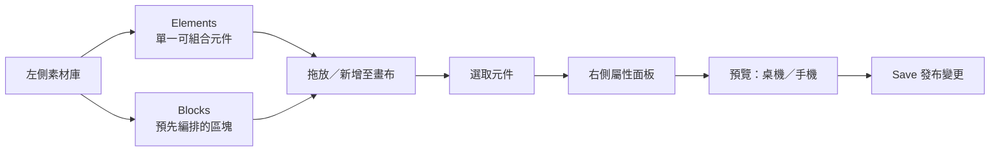
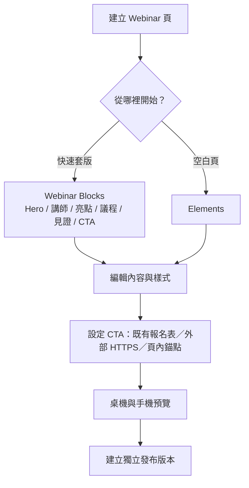

# systeme.io 一頁式網站編輯器研究筆記

> 研究日期：2026-09-13（Asia/Taipei）  
> 範圍：使用者已開啟的 systeme.io Page Editor；僅查看與加入後復原測試，**未按 Save**。

## 介面結構圖



這個分層很值得保留：**Elements 解決自由組裝，Blocks 解決快速起稿**。使用者先選一個有接近需求的 Block，再用 Elements 微調，會比從空白畫布慢慢拼更符合 SaaS 的使用情境。

## Elements：可組合元件盤點

| 分類 | 實際可選元件 |
| --- | --- |
| Text | Text、Headline、Bulleted list、Content box |
| Media | Image、Video、Audio、Carousel |
| Column layout | 4 columns、3 columns、2 columns、Row、Section |
| Form | Form、Form input、Button、Checkbox、reCAPTCHA、Calendar |
| Social | X share button、Survey |
| Other | **Countdown**、Menu、Horizontal line、Raw HTML、FAQ |

### 倒數計時：實際測試畫面與設定

加入後的預設呈現為四段式數字卡：

```text
┌────────┐ : ┌────────┐ : ┌────────┐ : ┌────────┐
│ 09 DAYS│   │23 HOURS│   │59 MIN. │   │59 SEC. │
└────────┘   └────────┘   └────────┘   └────────┘
```

選取元件後，屬性面板可設定：

| 設定群組 | 實測項目 |
| --- | --- |
| 時間 | Countdown type、固定日期與時間 |
| 到期行為 | Do nothing、Redirect to URL |
| 視覺 | 時間字級、標籤字級、字體、時間色、標籤色 |
| 排版 | Margin、桌機／手機可見性 |
| 進階 | HTML ID attribute |

研究時新增了一個 Countdown，確認面板後已用 Undo 移除；頂端 Undo 隨後回到停用，沒有儲存變更。

## Blocks：預組版型盤點

| 分類 | 觀察到的構成方向 | 對 Webinar 的用途 |
| --- | --- | --- |
| Opt-in forms | 標題＋文字＋單欄／水平表單、圖文雙欄、背景圖表單、影片＋表單 | 既有固定報名表的前導 CTA 或嵌入容器 |
| Features | 2～4 欄圖示／圖片、卡片、按鈕、強調中間卡 | 課程亮點、你會獲得什麼 |
| Page footers | Logo、選單、欄位文字、社群、地圖 | 可信度、政策與聯絡資訊 |
| Team presentation | 圓形照片、姓名職稱、左右圖片敘事、欄式介紹 | 講師介紹 |
| Welcome | 背景圖 Hero、影片 Hero、中央 Hero、雙圖 Hero | 活動首屏與主 CTA |
| Price plans | 2／3 欄價格卡、推薦方案強調、橫向價格比較 | 付費升級或方案比較 |
| Page headers | 品牌名稱或 Logo 加導覽 | 頁內錨點導覽 |
| Testimonials | 頭像、引言、卡片、彩色邊框、重疊卡片 | 學員見證與社會證明 |

實際加入測試了 Opt-in forms 的第一個 Block，產生「標題＋說明＋Email＋Submit」的一組區塊；確認它是一個完整可選取的群組後已用 Undo 復原。這也驗證 Block 的定位是一次插入多個 Elements，而不是另一種獨立元件系統。

## 值得借鏡的互動

1. 左側只讓使用者先選 **Elements / Blocks**，降低第一次使用的決策壓力。
2. 點選內容後，工具列顯示目前層級（Section → Row → Countdown），右側才提供該層級的設定與複製／建立 Block／移除。
3. 把手機預覽、預覽頁與 Undo／Redo 放在同一列，編輯、檢查、回退的閉環很短。
4. Block 命名直接描述版面結構，例如「Three card items, highlighted middle card」，使用者不用猜結果。

## CelebrateDeal 對應建議

CelebrateDeal 現有 Puck 編輯器已具備 Elements 型的基本內容、版面配置與轉換模組；也已有 Countdown、Carousel、Pricing、FAQ 與 CTA。下一輪介面調整可採以下對齊方式：



### 第一批 CelebrateDeal Blocks

1. **Webinar Hero**：眉標、活動標題、日期時間、主 CTA。
2. **Hero ＋倒數＋CTA**：適合名額或早鳥截止情境。
3. **講師可信度**：照片、職稱、三項經歷／數據。
4. **三項課程亮點**：圖示、標題、短說明。
5. **活動議程**：時間軸。
6. **價格方案**：可標記推薦方案，按鈕共用既有 CTA 動作。
7. **見證區**：引言、姓名、身分、頭像。
8. **FAQ ＋最終 CTA**：消除猶豫後導向固定報名表。

### 倒數計時的產品規格

倒數計時不應只有一串數字。第一版建議提供：

| 項目 | 建議行為 |
| --- | --- |
| 目標時間 | 固定截止時間（以含 offset 的 ISO 時間儲存）；或沿用活動開播時間 |
| 顯示 | 天／時／分／秒四格；手機可自動縮小且維持可讀性 |
| 時區 | 編輯器顯示「活動時區」，公開頁依同一個絕對時間倒數，避免訪客跨時區產生不同截止點 |
| 到期後 | 顯示替代訊息；下一版再加入「隱藏 CTA」或「轉到候補頁」兩種明確動作 |
| 搭配 CTA | 在倒數卡下方可放同一個報名表 CTA；到期後 CTA 依到期規則處理 |
| 文案 | 只允許真實的報名／優惠期限；不要用假倒數，長期信任比一時的紅色數字值錢 |

現有 CelebrateDeal Countdown 已有固定日期／依直播開播時間、到期訊息與公開頁即時更新。與本次參考相比，下一個有價值的補強是「倒數下 CTA」和「到期動作」，而不是再增加一個單純的數字元件。

## 結論

建議 CelebrateDeal 採 **Puck 的可組合 Elements + 自製 Webinar Blocks**。不需要複製 systeme.io 的表單編排，因為本產品的報名表是既有固定表單；Block 應把 CTA 預設連到這份表單，仍保留外部網址與頁內錨點選項。這樣可同時保有主辦者的自由度與新手的建頁速度。
